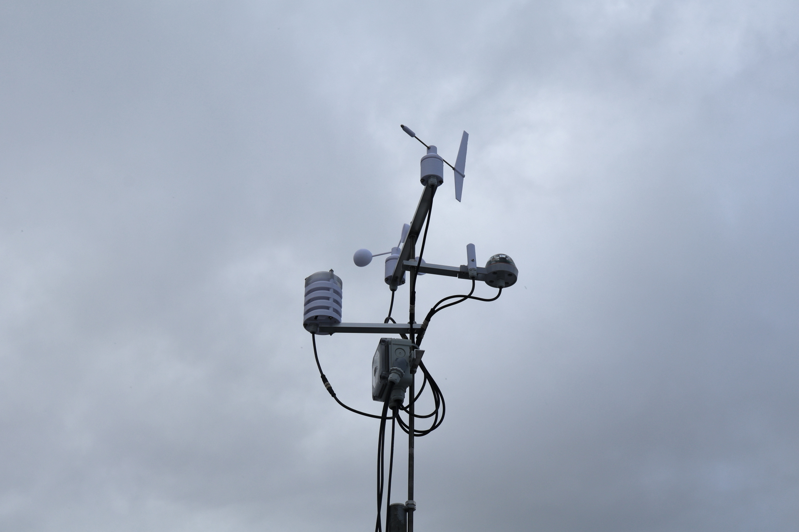

# Wetterstation Schönborn

Die Wetterstation befindet sich in Schönborn im Dresdener Norden (Postleitzahl 01465) auf rund 235 m über Normalhöhennull (NHN).

Im 5 Minuten Intervall werden alle wichtigen Wetterdaten automatisch erfasst und im Internet zur Verfügung gestellt.

Github-Webseite: [https://einsjason.github.io/wetter-schoenborn/](https://einsjason.github.io/wetter-schoenborn/)

Haupt-Webseite: [https://wetter.rammer.org](https://wetter.rammer.org)

Weathercloud: [https://app.weathercloud.net/d8388569860](https://app.weathercloud.net/d8388569860)

