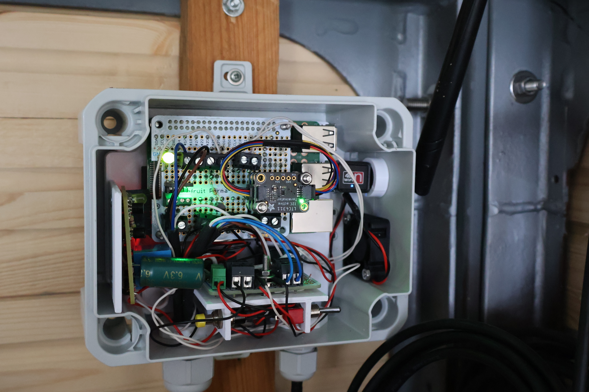

# Wetterstation Schönborn

Die Wetterstation befindet sich in Schönborn im Dresdener Norden (Postleitzahl 01465) auf rund 235 m über Normalhöhennull (NHN).

Im 5 Minuten Intervall werden alle wichtigen Wetterdaten automatisch erfasst und im Internet zur Verfügung gestellt.

Webseite: [wetter.rammer.org](https://wetter.rammer.org)

[Weathercloud](https://app.weathercloud.net/d8388569860)
[Weather Underground](https://www.wunderground.com/dashboard/pws/IDRESD482)

